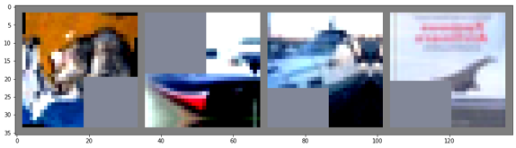

# Semi-supervised image classification using perturbed images 

## overview 
1) why semi-supervised learninig ?  
    21세기 데이터의 가치는 점점 높아지고 있고, 데이터는 점점 더 많아지고 있다. 한편, 레이블링된 데이터는 그 양이 제한적이며 휴먼 레이버한 작업이다. 특히 전문적인 도메인의 데이터는 레이블링 작업에 특히나 전문 인력이 필요하게 되고, 그는 또 막대한 비용을 필요로 한다. 만약 모델이 레이블링 되지 않은 데이터를 사용하여 학습할 수 있다면, 혹은 적은 레이블의 데이터만을 사용하여 학습할 수 있다면, 앞에서 언급한 비용을 줄이면서 데이터의 활용성을 높일 수 있을 것이다. 그리고 사실상, 사람은 레이블이 없어도 학습을 한다. 우리의 인공지능 모델 또한 레이블이 없는 환경에서도 그 개념을 학습할 수 있어야 한다고 생각한다. 

2) pseudo labeling and consistency regularization term  
    현재 semi-supervised image classification task의 몇몇 데이터셋에서 SOTA를 달성하고 있는 FixMatch[1] 모델의 경우, pseudo labeling과 consistency regularization term을 통한 learning framework을 통해 좋은 성능을 달성하는 것을 볼 수 있다. 모델이 labeled example을 통해 representation을 학습해 나가고, hyperparameter로 결정된 threshold를 통해 unlabeled example을 학습에 사용하는 비중을 매 iteration마다 결정한다. unlabeled example을 활용할 때, waekly augmented(Crop, Flip, Shift) example과 strongly augmented(RandAugment + Cutout) example 사이의 KL divergence term을 loss로 활용한다. 즉, input image가 조금 파악하기 어려워지더라도, 같은 이미지이면 같은 분포를 가지도록 학습을 하게 만드는 것이다. 

## proposed model 

나는 pseudo labeling 과 consistency regaularization term이 모두 결국은 좋은 representation 을 학습하는 기술적인 방법으로서 이용된다고 생각했다. 좋은 represetation을 학습시키는 것이 관건이고, FixMatch framework에서 더 다양하게 input image의 변형을 주어 consistency regularization term 을 학습에 활용할 수 있다면 더 좋은 represetation 을 학습하게 할 수 있지 않을까? 라고 생각하게 되었다. 따라서 본 프로젝트에서는 strong augmented image를 대체할 수 있는, pertuerbed image generation network 을 학습하여 모델에게 다양한 augmented image를 주어 좋은 representation을 가지게 하는 것을 목표로 하였다. 

1) main framework 

2) strong image generator 

## results and analysis 

### comparison to base images and generated images  
1) weakly augmented images

2) strongly augmented images

3) CVAE sampled images

4) CVAE randomized smoothing images (noise level σ=0.84)

원래의 목적은, 더욱 현실적이고 더욱 다양한 환경에서 있을법한 augmented image를 생성하는 것이었다. 반면, 생성된 이미지를 확인해보면 다양한 perturbation이 섞여 현실에 존재하지 않을 법한 이미지를 생성해 낸 것을 확인할 수 있다. 
이는 기존의 strongly augmented image에 비해서도 더 어려운, 사람으로서도 구분이 힘든 stronger augmented image라고 볼 수 있다. 

### experiment results 

| Model | FixMatch | FixMatch&CVAE(sampling) | FixMatch&CVAE(randomized smoothing σ=0.84) | FixMatch&CVAE(randomized smoothing σ=1.12)|
|:---:|:---:|:---:|:---:|:---:|
| Accuracy | 94.51 | 89.2 | 89.09 | 89.32 |
| Supervised loss | 0.022 | 0.026 | 0.027 | 0.027 |
| Unsupervised loss | 0.22 | 0.19 | 0.18 | 0.19 |
| Mask rate | 0.88 | 0.82 | 0.81 | 0.82 |

### Analysis
1) Fixmatch 보다 상대적으로 supervised data는 덜 학습하고, unsupervised loss에 더 학습하고 있음을 확인할 수 있다. 
        데이터가 어렵다보니 더 집중적으로 학습하려는 경향이 있는 것으로 보인다.

2) 데이터가 stronger(기존의 strongly augmented image보다 strong) 하다 보니, mask rate는 더 낮은 것으로 보인다.

3) Test time에는 이런 stronger 데이터들이 잘 들어오지 않으니, stronger data는 그렇게 큰 효능을 내지 못하는 것으로 보인다.  
        사실상 비현실적인 이미지에 더 가깝다. 이미지의 붕괴가 너무 지나쳐, 학습에 유용하지 않은 데이터로 변질되었다.

## future plans 
1) Conditional generative model의 image 생성 정도를 조절하여 좀 더 realistic augmented image를 생성시키는 데에 초점을 맞춰야 한다고 생각한다. 만약 realistic image를 잘 생성했다면 cutout 과 같은 기술을 사용하면 의미있으면서 어려운 이미지가 만들어질 것이라 생각된다.

2) 한편, FixMatch 알고리즘 자체의 단점으로서는, label이 애초에 희박한 환경이라면, 초기에 supervised loss term 으로부터 좋은 rerpresentation을 학습하는 데 어려웁이 있다. 따라서 unlabeled image를 이용하는 self-supervised learning을 통해 representation 을 먼저 학습한 뒤, label을 활용하여 classifier를 fine tuning 해 준다.   

## reference 
[1] Sohn, Kihyuk, et al. "Fixmatch: Simplifying semi-supervised learning with consistency and confidence." arXiv preprint arXiv:2001.07685 (2020). 
[2] Wong, Eric, and J. Zico Kolter. "Learning perturbation sets for robust machine learning." arXiv preprint arXiv:2007.08450 (2020).

